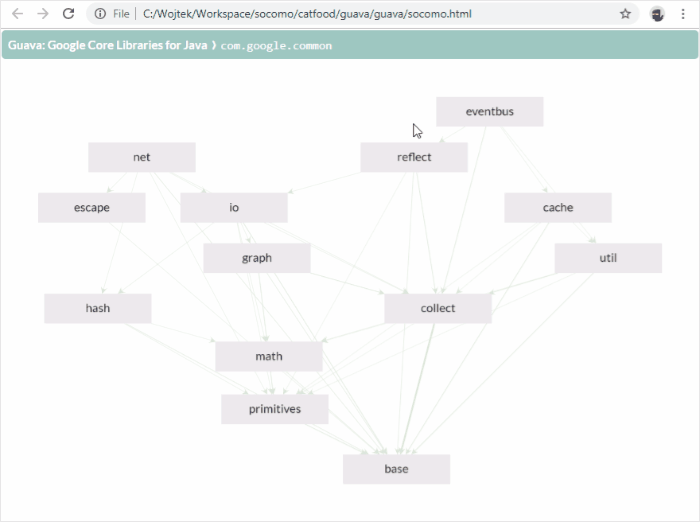
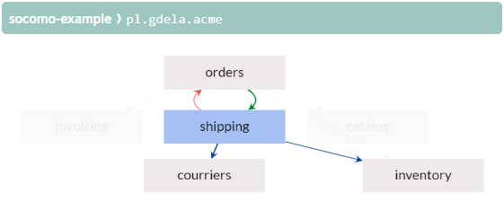

# Socomo - care about the composition of your java code 


Socomo is a simple tool to visualize the composition of your source code and track changes to the
composition as you progress with the development of your java project. You can use this tool to:

- Explain internal design of your modules by showing the diagram of component dependencies.
- Assure that architecture of your project is not being broken by seeing what new dependencies are added.
- Brag on your blog or twitter how great the structure of your code is, proving it with the diagrams.

See Socomo in action on the Guava project:

<p align="center">
  
</p>


## Quick Start

Try it now on your code! For a project build with maven do this:

```bash
mvn pl.gdela:socomo-maven:display
```

Alternatively, for a jar file, download the [latest release] and do this:

```bash
java -jar socomo-standalone.jar -d path/to/your.jar
```

Either of the above commands generates the `socomo.html` file and opens it in the browser.
You'll be presented with an interactive visualization of the structure of the code.

To track changes to the composition commit the `socomo.html` file to your source code repository
and add [socomo maven plugin](#socomo-maven-plugin) to your project. Whenever composition changes
the plugin updates this human-readable file, so you'll have a history of changes in the most
convenient place - in your source code repository.


## How to Read Diagrams

The diagram shows composition of your code at some specific _level_, typically the topmost package
of the project. Each subpackage at this level is a _component_ represented as node in the diagram.
Components are arranged on the diagram to form layers: a component uses other components that are
below it, and is used by components that are above it.

<p align="center">
  
</p>

The actual _dependencies_ analyzed from the bytecode are represented as edges. The wider the edge,
the stronger is the dependency between components. Click an edge to show details of the dependency,
i.e. see what classes and members from one component use which classes and members from the other
component.

When you hover over a component, blue edges show outgoing dependencies pointing to components used
by the selected one, and brown edges show incoming dependencies from the components that use
the selected one. Red edges are dependencies that point upwards, against the layers, and thus
are the cause of a cyclic dependency between two or more components.

The diagram is interactive, so that you can distill the information you need:

- <kbd>Click</kbd> dependency to show its details
- <kbd>Ctrl</kbd>+<kbd>Click</kbd> several components to emphasise dependencies between them
- <kbd>Ctrl</kbd>+<kbd>Drag</kbd> to select many components and once
- <kbd>Drag</kbd> a component or selected components around
- <kbd>Right Click</kbd> component to hide it and its dependencies
- <kbd>Right Click</kbd> on background to undo component hiding
- <kbd>U</kbd> to undo hiding all components
- <kbd>R</kbd> to rearrange the diagram automatically
- <kbd>Mouse Wheel</kbd> to zoom in and zoom out the diagram
- <kbd>Drag</kbd> on background to pan the diagram
- <kbd>S</kbd> to save the diagram as png file


## Best Practices for Composition

Socomo is an opinionated tool that requires you to structure the code in the right way to be most useful:

1. Make your topmost components speak about the business. They [shouldn't tell which frameworks
do you use][screaming architecture]. The technical details are more familiar to a developer
and thus less [important than the business domain][trivial grouping].

2. Keep your dependencies acyclic. If two components depend on each other, you cannot understand and
work on them one at a time, they actually [form one larger component][cyclic dependencies].

3. Let your components be balanced in size. Having one huge component amongst tens of smaller ones
defies the whole purpose of dividing the code.

Those principles will help you avoid your project being a [big ball of mud]. 

[screaming architecture]: https://blog.cleancoder.com/uncle-bob/2011/09/30/Screaming-Architecture.html
[trivial grouping]: https://devcards.io/trivial-grouping-of-classes
[cyclic dependencies]: https://lattix.com/blog/2017/07/26/why-cyclic-dependencies-are-bad
[big ball of mud]: http://www.mamuz.de/article/from-big-ball-of-mud-to-emergent-design/0Pw682Kxk


## Socomo Maven Plugin

Add following snippet to the `<build><plugins>` section in your `pom.xml` file. For multi-module projects,
you can add it just to the parent pom, so that it is inherited by all modules.

```xml
<plugin>
  <groupId>pl.gdela</groupId>
  <artifactId>socomo-maven</artifactId>
  <executions>
    <execution>
      <goals>
        <goal>analyze</goal>
      </goals>
      <configuration>
        <level>com.example.myproject</level>
      </configuration>
    </execution>
  </executions>
</plugin>
```

The `level` property is optional, if not given it will be guessed. The plugin should be bound to a phase
that is executed after your code has been compiled, so by default it is bound to the `package` phase.


## Socomo Standalone

Download the [latest release] and do this to get help how to use it:

```bash
java -jar socomo-standalone-*.jar --help
```


## Compatibility

Current version of Socomo is tested on Java 8, Java 11, Java 17, Java 21, and should also work
for any interim version. Previous versions have support for older Java, see below matrix,
but can lack some features. To use [socomo maven plugin](#socomo-maven-plugin), you'll need at least Maven 3.2.5.

| Socomo | Supported Java Versions | Maven (optional) |
|--------|-------------------------|------------------|
| 2.4.x  | from 8 to 23            | at least 3.2.5   |
| 2.3.x  | from 7 to 15            | at least 3.2.5   |

If you use other build tools, like Gradle or Sbt, you can use [socomo standalone](#socomo-standalone),
or you can write a plugin and contribute it to this project.

## Contributing

Raise an [issue or enhancement request](https://github.com/gdela/socomo/issues),
or better yet a [pull request](https://github.com/gdela/socomo/pulls).
Contact me at [wojciech@gdela.pl]() or [@WojciechGdela](https://twitter.com/WojciechGdela).

To develop Socomo you need [Maven] and [Node/Npm] installed on your machine. Then:
1. Run `mvn install` to install a snapshot version of Socomo in your local maven repository.
2. Use [socomo maven plugin](#socomo-maven-plugin) with the snapshot version
   or [socomo standalone](#socomo-standalone) from `socomo-core/target` directory
   to produce a `socomo.html` file.
3. Optionally you can use the `dogfood.sh` or `catfood.sh` scripts that perform both of the above at once.
4. Run `npm --prefix socomo-view run serve` to start serving `*.js` and `*.css` asset files.
5. Open the generated `socomo.html` file in the browser. Assets can be developed in-place, the browser
   will automatically reload them.


## Alternatives

Socomo is designed for simplicity and ease of use. If you would like to dig deeper into your code
structure or enforce some rules about dependencies, consider alternatives listed below.

[Stan4J](http://stan4j.com/) - simplest one to use, allows you to dig deeper into your code structure
and analyze dependencies in detail.  
[Structure101](https://structure101.com/) - comprehensive toolset to explore structure of your code,
analyze dependencies between code elements, define desired architecture of the code, integrate with
build systems to detect violations and track structure changes.  
[Lattix](https://lattix.com/solutions/) - similar to the above, but focused on visualization using dependency
structure matrix instead of graph diagrams.  
[JArchitect](https://www.jarchitect.com/dependenciesview) - toolset with dependency structure
matrix visualisation, interactive dependency graph, and code base querying.  
[Sonargraph](https://www.hello2morrow.com/products/sonargraph/explorer) - also a big toolset with
a free Sonargraph Explorer to visualize and explore dependencies in the code.  
[Softagram](https://softagram.com/products/) - a little bit different tool, adds report
of changes to the software structure as a comment to pull request.

Most of the above have plugins for SonarQube, a widely used "Continuous Inspection" system. They can
also be used from within IntelliJ/Eclipse, though having a standalone GUI for visualizing software
structure feels more ergonomic.

There is also a different category of tools, without visualizations and focused just
on enforcing dependency rules written upfront.

[ArchUnit](https://www.archunit.org/) - rules written as unit tests, in java code using fluent API.  
[jQAssistant](https://jqassistant.org/) - rules written using Cypher Neo4j graph query language,
checked by maven plugin.  
[Deptective](https://github.com/moditect/deptective) - rules written in JSON, checked during
compilation with `javac`.  
[Code-Assert](https://github.com/nidi3/code-assert#user-content-dependency) - bases on JDepend,
rules are written as unit tests.  
[Highwheel](https://github.com/hcoles/highwheel), [Jadecy](https://github.com/jeffhain/jadecy) -
two tools to detects package cycles, no custom rules though.

Tools that used to be useful once, but now are outdated and no longer maintained:
[JDepend](https://github.com/clarkware/jdepend),
[Classycle](http://classycle.sourceforge.net/),
[Macker](https://innig.net/macker/),
[Architexa](https://www.architexa.com/),
[Degraph](https://github.com/schauder/degraph).


<!-- Common Links -->
[latest release]: https://github.com/gdela/socomo/releases/latest
[maven]: https://maven.apache.org/
[node/npm]: https://nodejs.org/
