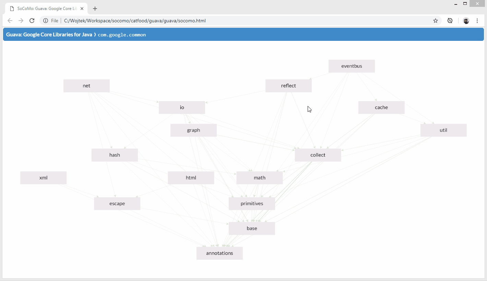

# Socomo - care about the composition of your java code 

Socomo is a simple tool to visualize the composition of your source code and track changes to the
composition as you progress with the development of your java project. You can use this tool to:

- Explain internal design of your modules to newcomers by showing them the diagram of component dependencies.
- Assure that architecture of your project is not being broken by seeing what new dependencies are added.
- Brag on your blog or twitter how great the structure of your code is, proving it with the diagrams.

## Quick Start

Try Socomo now on your code:

```bash
mvn pl.gdela:socomo-maven:display
```

This will generate the `socomo.html` file and open it in the browser, where you'll see
the visualization of code structure. Here's an example for Guava project:

<p align="center">
  
</p>

To track changes to the composition commit the `socomo.html` file to your source code repository
and add [socomo-maven plugin](#maven-plugin) to your `pom.xml`. Whenever composition changes
the build plugin will update this human-readable file, so you'll have a history of changes
in the most convenient place - in your source code repository.

## How Does It Work

Socomo analyses bytecode to find dependencies between code members, so code needs to be compiled
first. The generated `socomo.html` file is a concise representation of code composition at chosen
**level** - the root package of the diagram. Each child package of the root, together with subpackages
contained in it, is considered a **component** and depicted on the diagram as a node. Edges between
nodes represent dependencies.

## Best Practices for Composition

Socomo is an opinionated tool that requires you to structure the code in the right way to be most useful:

1. Make your topmost components speak about the business. They [shouldn't tell which frameworks
do you use][screaming architecture]. The technical details are more familiar to the developer
and thus less [important than the business domain][trivial grouping].

2. Keep your dependencies acyclic. If two components depend on each other, you cannot understand and
work on them one at a time, they actually [form one larger component][cyclic dependencies].

3. Let your components be balanced in size. Having one huge component amongst tens of smaller ones
defies the whole purpose of dividing the code.

Those principles will help you avoid your project being a [big ball of mud]. 

[screaming architecture]: https://blog.cleancoder.com/uncle-bob/2011/09/30/Screaming-Architecture.html
[trivial grouping]: https://devcards.io/trivial-grouping-of-classes
[cyclic dependencies]: https://lattix.com/blog/2017/07/26/why-cyclic-dependencies-are-bad
[big ball of mud]: http://www.mamuz.de/article/from-big-ball-of-mud-to-emergent-design/0Pw682Kxk

## Maven Plugin

Add this to the `<build><plugins>` section in your `pom.xml` file. For multi-module projects,
you can add it just to the parent pom, and it will be inherited by all modules:

```xml
<plugin>
  <groupId>pl.gdela</groupId>
  <artifactId>socomo-maven</artifactId>
  <executions>
    <execution>
      <goals>
        <goal>analyze</goal>
      </goals>
    </execution>
  </executions>
</plugin>
```

## Contributing

Raise an [issue or enhancement request](https://github.com/gdela/socomo/issues),
or better yet a [pull request](https://github.com/gdela/socomo/pulls).
Contact me at [wojciech@gdela.pl]() or [@WojciechGdela](https://twitter.com/WojciechGdela).
